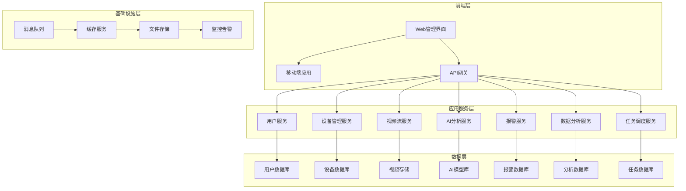

# SkyEye 智能监控系统设计文档

## 概述

SkyEye 智能监控系统是一个基于微服务架构的现代化智能安防平台，集成了视频监控、AI分析、设备管理、报警处理等核心功能。系统采用前后端分离的架构设计，支持高并发、高可用、可扩展的部署方式，为用户提供全方位的智能安防解决方案。

## 架构

### 系统架构图



### 技术架构

#### 前端技术栈
- **框架**: Vue.js 3.x + TypeScript
- **UI组件库**: Element Plus / Ant Design Vue
- **状态管理**: Pinia
- **路由管理**: Vue Router 4.x
- **HTTP客户端**: Axios
- **视频播放**: Video.js / HLS.js
- **图表可视化**: ECharts / D3.js
- **实时通信**: WebSocket / Socket.IO

#### 后端技术栈
- **开发语言**: Java 11
- **应用框架**: Spring Boot 3.x 
- **微服务框架**: Spring Cloud 
- **API网关**: Spring Cloud Gateway 
- **服务注册与发现**: Nacos 
- **配置管理**: Nacos Config 
- **负载均衡**: Nginx

#### 数据存储
- **关系型数据库**: PostgreSQL 14+ (主数据存储)
- **时序数据库**: InfluxDB (监控指标数据)
- **文档数据库**: MongoDB (日志和非结构化数据)
- **缓存**: Redis 7.x (会话、缓存)
- **搜索引擎**: Elasticsearch (日志搜索和分析)
- **对象存储**: MinIO / AWS S3 (视频文件存储)

#### AI与视频处理
- **AI框架**: TensorFlow / PyTorch
- **计算机视觉**: OpenCV
- **深度学习**: YOLO v8 (目标检测)
- **人脸识别**: FaceNet / ArcFace
- **视频编解码**: FFmpeg
- **流媒体服务**: WebRTC / HLS

## 组件和接口

### 核心组件

#### 1. 用户认证与权限管理组件

**组件职责**:
- 用户身份验证
- 权限控制和授权
- 会话管理
- 用户信息管理

**主要接口**:
```typescript
interface AuthService {
  login(credentials: LoginRequest): Promise<AuthResponse>
  logout(token: string): Promise<void>
  refreshToken(refreshToken: string): Promise<TokenResponse>
  validatePermission(userId: string, resource: string, action: string): Promise<boolean>
}

interface UserService {
  createUser(user: CreateUserRequest): Promise<User>
  updateUser(userId: string, updates: UpdateUserRequest): Promise<User>
  deleteUser(userId: string): Promise<void>
  getUserById(userId: string): Promise<User>
  listUsers(filters: UserFilters): Promise<PaginatedUsers>
}
```

#### 2. 设备管理组件

**组件职责**:
- 设备注册和配置
- 设备状态监控
- 设备控制指令
- 设备性能监控

**主要接口**:
```typescript
interface DeviceService {
  registerDevice(device: DeviceRegistration): Promise<Device>
  updateDevice(deviceId: string, updates: DeviceUpdate): Promise<Device>
  deleteDevice(deviceId: string): Promise<void>
  getDeviceStatus(deviceId: string): Promise<DeviceStatus>
  controlDevice(deviceId: string, command: DeviceCommand): Promise<CommandResult>
  listDevices(filters: DeviceFilters): Promise<PaginatedDevices>
}

interface DeviceMonitorService {
  getDeviceMetrics(deviceId: string, timeRange: TimeRange): Promise<DeviceMetrics>
  subscribeDeviceStatus(deviceId: string, callback: StatusCallback): void
  getDeviceHealth(deviceId: string): Promise<HealthStatus>
}
```

#### 3. 视频流处理组件

**组件职责**:
- 视频流接收和转码
- 实时视频推流
- 视频录制和存储
- 视频回放服务

**主要接口**:
```typescript
interface VideoStreamService {
  startStream(deviceId: string, streamConfig: StreamConfig): Promise<StreamInfo>
  stopStream(streamId: string): Promise<void>
  getStreamUrl(deviceId: string, quality: VideoQuality): Promise<string>
  recordVideo(deviceId: string, duration: number): Promise<RecordingInfo>
  getRecordings(deviceId: string, timeRange: TimeRange): Promise<Recording[]>
}

interface VideoControlService {
  ptzControl(deviceId: string, command: PTZCommand): Promise<void>
  setVideoParameters(deviceId: string, params: VideoParams): Promise<void>
  captureSnapshot(deviceId: string): Promise<SnapshotInfo>
}
```

#### 4. AI分析引擎组件

**组件职责**:
- 视频内容智能分析
- 人脸识别和比对
- 行为分析和异常检测
- AI模型管理和更新

**主要接口**:
```typescript
interface AIAnalysisService {
  analyzeVideo(videoStream: VideoStream, analysisType: AnalysisType[]): Promise<AnalysisResult>
  detectFaces(image: ImageData): Promise<FaceDetection[]>
  recognizeFace(faceImage: ImageData, faceDatabase: string): Promise<FaceRecognitionResult>
  detectBehavior(videoSegment: VideoSegment): Promise<BehaviorAnalysis>
  detectObjects(image: ImageData): Promise<ObjectDetection[]>
}

interface AIModelService {
  loadModel(modelId: string): Promise<AIModel>
  updateModel(modelId: string, modelData: ModelData): Promise<void>
  listAvailableModels(): Promise<AIModel[]>
  getModelPerformance(modelId: string): Promise<ModelMetrics>
}
```

#### 5. 报警管理组件

**组件职责**:
- 报警事件生成和分类
- 报警通知和分发
- 报警处理流程管理
- 报警规则配置

**主要接口**:
```typescript
interface AlertService {
  createAlert(alert: CreateAlertRequest): Promise<Alert>
  updateAlertStatus(alertId: string, status: AlertStatus): Promise<Alert>
  getAlert(alertId: string): Promise<Alert>
  listAlerts(filters: AlertFilters): Promise<PaginatedAlerts>
  acknowledgeAlert(alertId: string, userId: string): Promise<void>
}

interface NotificationService {
  sendNotification(notification: NotificationRequest): Promise<void>
  configureNotificationRules(rules: NotificationRule[]): Promise<void>
  getNotificationHistory(filters: NotificationFilters): Promise<NotificationHistory[]>
}
```

#### 6. 数据分析组件

**组件职责**:
- 数据统计和聚合
- 趋势分析和预测
- 报表生成
- AI增强分析

**主要接口**:
```typescript
interface AnalyticsService {
  generateReport(reportType: ReportType, parameters: ReportParameters): Promise<Report>
  getStatistics(metricType: MetricType, timeRange: TimeRange): Promise<Statistics>
  predictTrend(dataType: DataType, predictionPeriod: number): Promise<TrendPrediction>
  getInsights(analysisRequest: InsightRequest): Promise<AIInsight[]>
}

interface DataAggregationService {
  aggregateData(dataSource: DataSource, aggregationType: AggregationType): Promise<AggregatedData>
  createDashboard(dashboardConfig: DashboardConfig): Promise<Dashboard>
  exportData(exportRequest: DataExportRequest): Promise<ExportResult>
}
```

### 接口规范

#### RESTful API设计原则
- 使用标准HTTP方法 (GET, POST, PUT, DELETE)
- 统一的响应格式
- 适当的HTTP状态码
- API版本控制 (/api/v1/)
- 请求和响应数据验证

#### 统一响应格式
```typescript
interface ApiResponse<T> {
  success: boolean
  code: number
  message: string
  data?: T
  timestamp: number
  requestId: string
}

interface PaginatedResponse<T> {
  items: T[]
  total: number
  page: number
  pageSize: number
  hasNext: boolean
}
```

## 数据模型

### 核心数据实体

#### 用户实体
```typescript
interface User {
  id: string
  username: string
  email: string
  fullName: string
  role: UserRole
  status: UserStatus
  permissions: Permission[]
  lastLoginAt?: Date
  createdAt: Date
  updatedAt: Date
}

enum UserRole {
  SYSTEM_ADMIN = 'system_admin',
  SECURITY_ADMIN = 'security_admin',
  OPERATOR = 'operator',
  VIEWER = 'viewer'
}

enum UserStatus {
  ACTIVE = 'active',
  INACTIVE = 'inactive',
  LOCKED = 'locked'
}
```

#### 设备实体
```typescript
interface Device {
  id: string
  name: string
  type: DeviceType
  model: string
  manufacturer: string
  serialNumber: string
  ipAddress: string
  macAddress: string
  location: Location
  status: DeviceStatus
  capabilities: DeviceCapability[]
  configuration: DeviceConfig
  createdAt: Date
  updatedAt: Date
}

enum DeviceType {
  CAMERA = 'camera',
  DOOR_ACCESS = 'door_access',
  SENSOR = 'sensor',
  ALARM = 'alarm'
}

enum DeviceStatus {
  ONLINE = 'online',
  OFFLINE = 'offline',
  ERROR = 'error',
  MAINTENANCE = 'maintenance'
}
```

#### 报警实体
```typescript
interface Alert {
  id: string
  type: AlertType
  severity: AlertSeverity
  title: string
  description: string
  deviceId: string
  location: Location
  status: AlertStatus
  assignedTo?: string
  acknowledgedBy?: string
  acknowledgedAt?: Date
  resolvedAt?: Date
  metadata: Record<string, any>
  createdAt: Date
  updatedAt: Date
}

enum AlertType {
  UNAUTHORIZED_ACCESS = 'unauthorized_access',
  ABNORMAL_BEHAVIOR = 'abnormal_behavior',
  DEVICE_FAILURE = 'device_failure',
  SYSTEM_ERROR = 'system_error'
}

enum AlertSeverity {
  CRITICAL = 'critical',
  HIGH = 'high',
  MEDIUM = 'medium',
  LOW = 'low'
}
```

### 数据库设计

#### 主数据库 (PostgreSQL)
- **用户管理**: users, roles, permissions, user_sessions
- **设备管理**: devices, device_types, device_configurations
- **报警管理**: alerts, alert_rules, notifications
- **系统配置**: system_settings, configurations

#### 时序数据库 (InfluxDB)
- **设备指标**: device_metrics (CPU, 内存, 网络等)
- **系统性能**: system_performance
- **业务指标**: business_metrics (人流量, 事件统计等)

#### 文档数据库 (MongoDB)
- **操作日志**: operation_logs
- **AI分析结果**: analysis_results
- **视频元数据**: video_metadata

## 错误处理

### 错误分类和处理策略

#### 1. 业务逻辑错误
- **用户认证失败**: 返回401状态码，提示用户重新登录
- **权限不足**: 返回403状态码，记录访问日志
- **资源不存在**: 返回404状态码，记录请求信息
- **业务规则违反**: 返回400状态码，返回详细错误信息

#### 2. 系统错误
- **数据库连接失败**: 自动重试，记录错误日志，降级处理
- **外部服务不可用**: 熔断机制，返回缓存数据或默认值
- **内存不足**: 清理缓存，记录警告日志，通知管理员
- **网络超时**: 重试机制，记录网络状态

#### 3. AI分析错误
- **模型加载失败**: 使用备用模型，记录错误信息
- **分析超时**: 终止分析任务，返回部分结果
- **识别准确度低**: 标记为低置信度结果，人工复核

### 错误监控和告警

```typescript
interface ErrorHandler {
  handleError(error: Error, context: ErrorContext): Promise<void>
  logError(error: Error, severity: ErrorSeverity): void
  notifyAdministrator(error: CriticalError): Promise<void>
  retryOperation(operation: Operation, maxRetries: number): Promise<any>
}

interface ErrorContext {
  userId?: string
  deviceId?: string
  requestId: string
  timestamp: Date
  stackTrace: string
}
```

## 测试策略

### 测试层次

#### 1. 单元测试
- **覆盖率要求**: 代码覆盖率 ≥ 80%
- **测试框架**: Jest (前端) / JUnit (后端)
- **测试内容**: 业务逻辑、工具函数、数据处理

#### 2. 集成测试
- **API测试**: 使用Postman/Newman进行API接口测试
- **数据库测试**: 测试数据访问层和数据一致性
- **消息队列测试**: 测试异步消息处理

#### 3. 端到端测试
- **UI自动化测试**: 使用Cypress/Playwright
- **业务流程测试**: 完整的用户操作流程
- **性能测试**: 使用JMeter进行负载测试

#### 4. AI模型测试
- **准确性测试**: 使用标准数据集验证模型准确率
- **性能测试**: 测试模型推理速度和资源消耗
- **鲁棒性测试**: 测试模型对异常输入的处理能力

### 测试数据管理

```typescript
interface TestDataManager {
  createTestUser(role: UserRole): Promise<User>
  createTestDevice(type: DeviceType): Promise<Device>
  generateTestVideo(duration: number, scenario: TestScenario): Promise<VideoFile>
  cleanupTestData(): Promise<void>
}

interface TestScenario {
  hasFaces: boolean
  hasAbnormalBehavior: boolean
  hasObjects: boolean
  lightingCondition: LightingCondition
}
```

### 持续集成/持续部署 (CI/CD)

#### CI流程
1. **代码提交触发**: Git webhook触发构建
2. **代码质量检查**: ESLint, SonarQube代码扫描
3. **自动化测试**: 运行单元测试和集成测试
4. **构建镜像**: Docker镜像构建和推送
5. **安全扫描**: 容器镜像安全扫描

#### CD流程
1. **环境准备**: 自动化环境配置
2. **数据库迁移**: 自动执行数据库变更
3. **服务部署**: 蓝绿部署或滚动更新
4. **健康检查**: 服务启动后的健康状态检查
5. **监控告警**: 部署后的监控和告警配置

## 安全考虑

### 身份认证和授权
- **多因素认证**: 支持短信、邮箱、TOTP等多种验证方式
- **JWT令牌**: 使用JWT进行无状态身份验证
- **权限控制**: 基于RBAC的细粒度权限控制
- **会话管理**: 安全的会话创建、维护和销毁

### 数据安全
- **数据加密**: 敏感数据存储加密 (AES-256)
- **传输加密**: HTTPS/TLS 1.3加密传输
- **数据脱敏**: 日志和测试环境中的敏感数据脱敏
- **备份加密**: 数据备份文件加密存储

### 网络安全
- **防火墙配置**: 严格的网络访问控制
- **DDoS防护**: 流量清洗和限流机制
- **API安全**: API限流、防重放攻击
- **安全审计**: 完整的安全事件日志记录

### 视频数据安全
- **视频加密**: 视频文件存储加密
- **访问控制**: 基于权限的视频访问控制
- **水印技术**: 视频水印防止非法传播
- **隐私保护**: 敏感区域马赛克处理

## 性能优化

### 前端性能优化
- **代码分割**: 路由级别的代码分割和懒加载
- **资源压缩**: JavaScript、CSS、图片资源压缩
- **缓存策略**: 浏览器缓存和CDN缓存配置
- **虚拟滚动**: 大数据列表的虚拟滚动实现

### 后端性能优化
- **数据库优化**: 索引优化、查询优化、连接池配置
- **缓存策略**: Redis缓存热点数据
- **异步处理**: 消息队列处理耗时操作
- **负载均衡**: 多实例部署和负载均衡

### 视频处理优化
- **硬件加速**: GPU加速视频编解码
- **流媒体优化**: 自适应码率流媒体传输
- **CDN分发**: 视频内容CDN分发
- **预处理**: 视频预处理和缓存

### AI分析优化
- **模型优化**: 模型量化和剪枝
- **批处理**: 批量处理提高GPU利用率
- **模型缓存**: 常用模型内存缓存
- **分布式推理**: 多GPU分布式推理

## 可扩展性设计

### 水平扩展
- **微服务架构**: 服务独立部署和扩展
- **数据库分片**: 数据库水平分片
- **消息队列集群**: 消息队列集群部署
- **负载均衡**: 自动负载均衡和服务发现

### 垂直扩展
- **资源监控**: 实时监控系统资源使用情况
- **自动扩容**: 基于指标的自动扩容
- **资源隔离**: 容器化部署和资源隔离
- **性能调优**: 定期性能分析和调优

### 功能扩展
- **插件架构**: 支持第三方插件扩展
- **API开放**: 开放API供第三方集成
- **模块化设计**: 功能模块独立开发和部署
- **配置驱动**: 通过配置实现功能开关